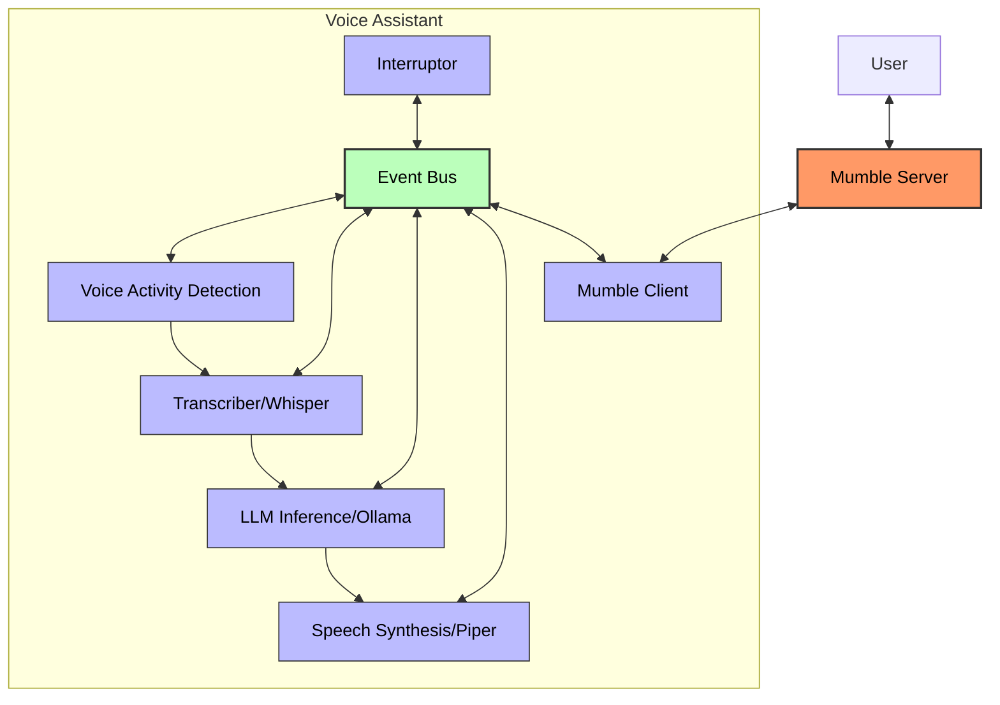

# AI Assistant

An open-source voice assistant that integrates with Mumble for voice chat capabilities. It listens to voice input, transcribes it using Whisper, processes the text with Ollama LLMs, and responds using Piper's speech synthesis.

> NOTE: ⚠️ UNDER CONSTRUCTION ⚠️

## Prerequisites
- Nix package manager with flakes enabled
- Docker and Docker Compose
- NVIDIA GPU (optional, but recommended for faster inference)

## Quick Start
1. Ensure that prerequisites are meet
2. Run `nix develop`
3. Run **Mumble** server `docker-compose up mumble -d`
4. Run **Ollama** `docker-compose up ollama -d` if needed
5. Run **Assistant** `python assistant/main.py`
6. Run [Mumble client](https://www.mumble.info/) application
7. Connect to Mumble server using Mumble client (`localhost`)
8. You should see Assistant on the server in Mumble client UI
9. You could talk to Assistant or run test from `questions.ipynb`

## Current Architecture

All these components communicate through the Event Bus using a reactive programming pattern, which allows for a flexible, event-driven architecture where components can respond to events without direct coupling.



## Features
- **Voice Activation**: Detects and processes speech via Voice Activity Detection (VAD)
- **Speech Recognition**: Transcribes speech to text using Whisper
- **Natural Language Processing**: Processes queries and generates responses using Ollama LLMs
- **Text-to-Speech**: Converts text responses to natural speech using Piper
- **Mumble Integration**: Works within Mumble voice chat servers
- **Interruption Handling**: Allows interrupting the assistant while it's speaking

## Development using Nix [devenv](https://devenv.sh/)

This guide explains how to install Nix package manager and setup development environment using the Nix package manager.

## Installing Nix on Ubuntu or other distro that uses `systemd`.

> Same should work for MacOS but omit 3rd step.

1. Install Nix package manager:
```bash
sh <(curl -L https://nixos.org/nix/install) --daemon
```
> Yes, yes, yes, to the end. And that's basically done.

2. Enable Flakes support by creating or editing `~/.config/nix/nix.conf`:
```bash
mkdir -p ~/.config/nix
echo "experimental-features = nix-command flakes" >> ~/.config/nix/nix.conf
```

3. Restart the Nix daemon:
```bash
sudo systemctl restart nix-daemon
```

### Install Nix [devenv](https://devenv.sh/)

Command below should be enough.
```bash
nix profile install nixpkgs#devenv
```

> If not, follow the official guide: https://devenv.sh/getting-started/

### Activate development environment
Run `nix develop` it will create environment like `conda`/`mamba`


